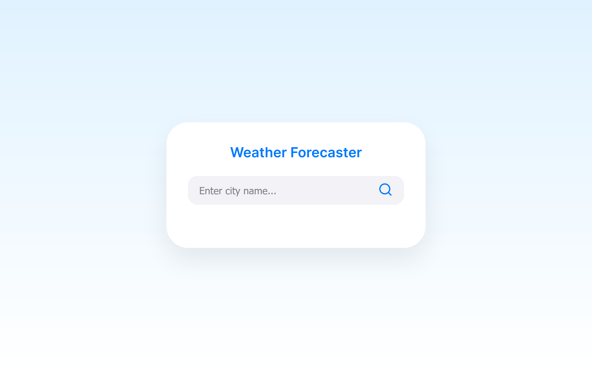
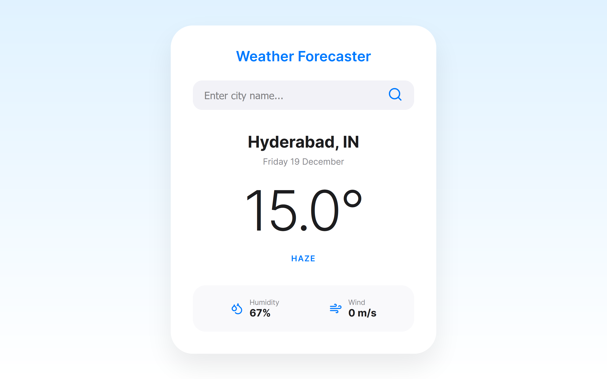

# Weather-Forecaster 🌤️

A simple web-based weather forecasting application, It lets users enter a city or location and shows current weather information and a short forecast. The app pulls real weather data from a public API (like OpenWeatherMap), then displays temperature, humidity and Wind Speed in a responsive UI.

Built using **Python (Flask)** and a public weather API, this project focuses on clean UI, API integration, and backend-frontend interaction.

---

## Screenshots

<p align="center">
  
  
</p>

---

## Features

- Search weather by city name
- Shows:
  - Current temperature
  - Date and location
  - Weather condition
  - Humidity
  - Wind speed
- Simple, responsive card-based UI
- Error handling for invalid inputs

---

## Tech Stack

- Python
- Flask
- HTML, CSS
- Weather API

---

## Project Structure
```bash
Weather-Forecaster/
├── app.py
├── requirements.txt
├── templates/
│ └── index.html
├── static/
  ├── css/
  └── style.css
```

---

## Live Demo
https://weather-forecaster-y9pe.onrender.com

---

## Setup (Local)
```bash
git clone https://github.com/vardhineeditharak/Weather-Forecaster.git
cd Weather-Forecaster
pip install -r requirements.txt
python app.py
```

## Create a .env file:
API_KEY=your_weather_api_key

## Open
http://localhost:5000

## Deployment
Deployed using Render with environment variables for API security.
